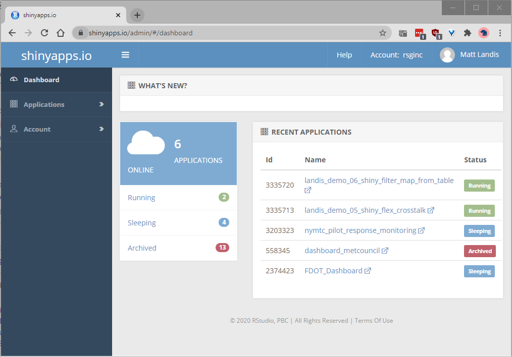

# Moving pictures: Interactive documents with R and Markdown

## Goals for this talk

- Share my experience creating a tool for visualizing household travel survey data (htsViewer)
- Demonstrate some tools for presenting data
  - internally for quality assurance, communication to colleagues
  - externally for reporting to clients
- Focus is on **interactive** data presentation  

## htsViewer

  - Goal is to make it easy to see HTS data
  - Project is at https://github.com/RSGInc/htsViewer
  - Show (running locally)

## Outline

- R + Markdown = RMarkdown
- leaflet
- DT (DataTable)
- flexdashboard
- crosstalk
- Shiny


# R + Markdown = RMarkdown

## R

  - If you work with data, you probably already know a lot about R
  - if you don't, it's one of the main computer languages we use here at RSG
  - Extremely versatile language for data analysis
  - One of the most widely used data languages in the world, along with SQL and Python
  - Based heavily on S, a statistical computer language developed at Bell Labs in the 1970's
  - Excellent data visualization facilities built-in
  
## Markdown

```
## Markdown

This is **Markdown**, a lightweight markup language. You use it to format text.

I like it because:

  - It is very readable even in plain text
  - code is easy to distinguish: `foo`, `bar`, `baz`.
  - It's versatile!  Use in  [Teams](https://support.microsoft.com/en-ie/office/use-markdown-formatting-in-teams-4d10bd65-55e2-4b2d-a1f3-2bebdcd2c772) and [Github](https://guides.github.com/features/mastering-markdown/), not to mention [RStudio](https://rmarkdown.rstudio.com/).
  - Create HTML pages, presentations, Word docs, PDF, dashboards, etc.
  - Learn more at [markdownguide.org](https://www.markdownguide.org/getting-started/) and try it out at [dillinger.io](https://dillinger.io/).

```

## Markdown

This is **Markdown**, a lightweight markup language. You use it to format text.

I like it because:

  - It is very readable even in plain text
  - code is easy to distinguish: `foo`, `bar`, `baz`.
  - It's versatile!  Use in  [Teams](https://support.microsoft.com/en-ie/office/use-markdown-formatting-in-teams-4d10bd65-55e2-4b2d-a1f3-2bebdcd2c772) and [Github](https://guides.github.com/features/mastering-markdown/), not to mention [RStudio](https://rmarkdown.rstudio.com/).
  - Create HTML pages, presentations, Word docs, PDF, dashboards, etc.
  - Learn more at [markdownguide.org](https://www.markdownguide.org/getting-started/) and try it out at [dillinger.io](https://dillinger.io/).

## RMarkdown

  - Combines plain text of Markdown with R code
  - Compiling replaces R code with output of R - figures, tables, text
  - Can export to HTML, PDF, Word, presentations (like this one), dashboards
  - Can produce interactive documents with [htmlwidgets](https://www.htmlwidgets.org/) or [shiny](https://shiny.rstudio.com/) (or both combined)
  - Easy to share as a stand-alone HTML file
  - Results can use RSG branding (`CSS` is helpful)
  - Show [example](https://github.com/landisrm/rTED_2020/blob/main/01_rmarkdown_static.Rmd

# Interactive Documents

## htmlwidgets

- [htmlwidgets](http://www.htmlwidgets.org/index.html): packages that wrap JavaScript libraries and make them accessible in R
- [DT](https://rstudio.github.io/DT/) ([DataTables](https://datatables.net/))
- [leaflet](https://rstudio.github.io/leaflet/) ([Leaflet](https://leafletjs.com/))
- Show [example](file:///C:/Users/matt.landis/OneDrive%20-%20Resource%20Systems%20Group,%20Inc/Git/rTED_2020/02_rmarkdown_interactive.html)
- File is shareable as a single `.html` file.

## flexdashboard

- https://rmarkdown.rstudio.com/flexdashboard/
- "Easy interactive dashboards for R"
- Based on RMarkdown
- Provides easy to use layouts
- Incorporates htmlwidgets and/or Shiny
- Show [example](file:///C:/Users/matt.landis/OneDrive%20-%20Resource%20Systems%20Group,%20Inc/Git/rTED_2020/03_flexdashboard.html)

## crosstalk

  - https://rstudio.github.io/crosstalk/
  - Interactivity between widgets through shared data object
  - Very simple to set up
  - All client side.  No server. (easy to share as a file)
  - Limitations
    - Dataset has to be relatively small (fits in file)
    - Not all graphics are supported (e.g. histograms, lines on maps)
    - Not many packages can interact with crosstalk
      - DT
      - Leaflet
      - Plotly
  - Show [example](file:///C:/Users/matt.landis/OneDrive%20-%20Resource%20Systems%20Group,%20Inc/Git/rTED_2020/04_crosstalk_flexdashboard.html)

## Shiny

  - https://shiny.rstudio.com/
  - R package for building interactive web apps
  - Much more flexible than RMarkdown alone but harder to set up
  - RStudio has ability to run locally (e.g. htsViewer)
  - Sharing requires a web server
  - We (RSG) have an account on `shinyapps.io`

## shinyapps.io

<p align='center'>
  
</p>

## shinyapps.io

- Excellent for sharing Rmarkdown and Shiny web apps
- Share a link instead of a file
- Easier to debug and modify than a set of scripts sent to client
- Custom URLs, e.g. demo.rsginc.com/rted_2020/shiny_test/
- Secure 
  - Can manage access to individuals
  - Can access databases so data isn't stored in web page

# Summary

## Packages 

  - rmarkdown
  - leaflet
  - datatable
  - flexdashboard
  - crosstalk
  - shiny
  - shinyapps.io


## Links

  - Code and HTML files for this presentation: https://github.com/landisrm/rTED_2020
  - Flexdashboard document: https://rsginc.shinyapps.io/landis_demo_05_shiny_flex_crosstalk/
  - Shinydashboard document: https://rsginc.shinyapps.io/landis_demo_06_shiny_filter_map_from_table/
  - shinyapps.io: https://www.shinyapps.io/admin/#/dashboard
  
