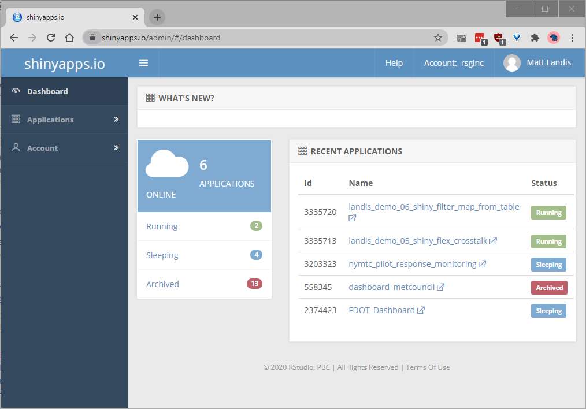

```{r setup, include=FALSE}
knitr::opts_chunk$set(echo = FALSE, comment='')
knitr::knit_engines$set('markdown')

```


## htsViewer

  - Data visualization for quality control and assurance of HTS data
  - Interactive dashboard
  - Based on RMarkdown
  - In an alpha, proof of concept state
  - Project is at https://github.com/RSGInc/htsViewer
  - Show (running locally)

## Goals for this talk

- Demonstrate some tools for presenting data
  - internally for quality assurance, communication to colleagues
  - externally for reporting to clients
- Focus is on **interactive** data presentation  
- Strengths and limitations of different approaches

## Outline

- R + Markdown = `RMarkdown`
- `leaflet`
- `DT` (DataTable)
- `flexdashboard`
- `crosstalk`
- `shiny`


# R + Markdown = RMarkdown

## `R`

  - If you work with data, you probably already know a lot about `R`
  - if you don't, it's one of the main computer languages we use here at RSG
  - One of the most widely used data languages in the world, along with `SQL` and `Python`
  - Descended from `S`, a computer language developed at Bell Labs in the 1970's for statistical analysis and data visualization
  - Open source and free, with excellent framework for contributing extensions
  - Over 10,000 packages available

  
## Markdown

```
## Markdown

This is [**Markdown**](https://daringfireball.net/projects/markdown/), a lightweight markup language for formatting text.

I like it because:

  - It is very readable even in plain text
  - code is easy to distinguish: `foo`, `bar`, `baz`.
  - It's versatile!  Use in  [Teams](https://support.microsoft.com/en-ie/office/use-markdown-formatting-in-teams-4d10bd65-55e2-4b2d-a1f3-2bebdcd2c772) and [Github](https://guides.github.com/features/mastering-markdown/), not to mention [RStudio](https://rmarkdown.rstudio.com/).
  - Learn more at [markdownguide.org](https://www.markdownguide.org/getting-started/) and try it out at [dillinger.io](https://dillinger.io/).

```

## Markdown

This is [**Markdown**](https://daringfireball.net/projects/markdown/), a lightweight markup language for formatting text.

I like it because:

  - It is very readable even in plain text
  - code is easy to distinguish: `foo`, `bar`, `baz`.
  - It's versatile!  Use in  [Teams](https://support.microsoft.com/en-ie/office/use-markdown-formatting-in-teams-4d10bd65-55e2-4b2d-a1f3-2bebdcd2c772) and [Github](https://guides.github.com/features/mastering-markdown/), not to mention [RStudio](https://rmarkdown.rstudio.com/).
  - Learn more at [markdownguide.org](https://www.markdownguide.org/getting-started/) and try it out at [dillinger.io](https://dillinger.io/).

## RMarkdown

Combines the two together in a single document like this:

```
## Including Plots

You can also embed plots, for example, here is a simple map of home locations in an HTS survey.

``{r map}
ggplot(hh_map, aes(x=reported_home_lon, y=reported_home_lat)) +
  geom_point(size=2, color='blue', alpha=0.1) +
  coord_equal() +
  labs(x='', y='') +
  theme_bw() 
`` 

```

## RMarkdown

  - Combines plain text of Markdown with R code
  - Compiling replaces R code with its output - figures, tables, text
  - Can export to HTML, PDF, Word, presentations (like this one), dashboards
  - Easy to share as a stand-alone HTML file
  - Results can use RSG branding (custom CSS, Word templates)
  - Can produce interactive documents with [htmlwidgets](https://www.htmlwidgets.org/) or [shiny](https://shiny.rstudio.com/) (or both combined)

Show [example](https://github.com/landisrm/rTED_2020/blob/main/01_rmarkdown_static.Rmd)

# Interactive Documents

## htmlwidgets

- [htmlwidgets](http://www.htmlwidgets.org/index.html): a "framework that bridges R and JavaScript".  R packages that make JavaScript libraries accessible in R.
- [DT](https://rstudio.github.io/DT/) ([DataTables](https://datatables.net/))
- [leaflet](https://rstudio.github.io/leaflet/) ([Leaflet](https://leafletjs.com/))
- File is shareable as a single `.html` file.
- Show [example](file:///C:/Users/matt.landis/OneDrive%20-%20Resource%20Systems%20Group,%20Inc/Git/rTED_2020/02_rmarkdown_interactive.html)


## flexdashboard

- https://rmarkdown.rstudio.com/flexdashboard/
- "Easy interactive dashboards for R"
- Based on RMarkdown
- Provides easy to use layouts
- Incorporates htmlwidgets and/or Shiny
- Show [example](file:///C:/Users/matt.landis/OneDrive%20-%20Resource%20Systems%20Group,%20Inc/Git/rTED_2020/03_flexdashboard.html)

## crosstalk

  - https://rstudio.github.io/crosstalk/
  - Interactivity between widgets through shared data object
  - Very simple to set up
  - All client side.  No server. (easy to share as a file)
  - Limitations
    - Dataset has to be relatively small (fits in file)
    - Not all graphics are supported (e.g. histograms, lines on maps)
    - Not many packages can interact with crosstalk
      - DT
      - Leaflet
      - Plotly
  - Show [example](file:///C:/Users/matt.landis/OneDrive%20-%20Resource%20Systems%20Group,%20Inc/Git/rTED_2020/04_crosstalk_flexdashboard.html)

## Shiny

  - https://shiny.rstudio.com/
  - R package for building interactive web apps
  - Much more flexible than RMarkdown alone but harder to set up
  - RStudio has ability to run locally (e.g. htsViewer)
  - Sharing requires a web server
  - Show [example](https://rsginc.shinyapps.io/landis_demo_05_shiny_flex_crosstalk/)

## shinyapps.io

<p align='center'>
  
  https://www.shinyapps.io/admin/#/dashboard
</p>


## shinyapps.io

- Excellent for sharing Rmarkdown and Shiny web apps
- Share a link instead of a file
- Easier to debug and modify than a set of scripts sent to client
- Custom URLs, e.g. https://demo.rsginc.com/rted_2020/shiny_test/
- Secure 
  - Can manage access to individuals
  - Can access databases so data isn't stored in web page

# Summary

## Packages 

  - rmarkdown
  - leaflet
  - datatable
  - flexdashboard
  - crosstalk
  - shiny
  - shinyapps.io


## Links

  - Code and HTML files for this presentation: https://github.com/landisrm/rTED_2020
  - Flexdashboard document: https://rsginc.shinyapps.io/landis_demo_05_shiny_flex_crosstalk/
  - Shinydashboard document: https://rsginc.shinyapps.io/landis_demo_06_shiny_filter_map_from_table/
  - shinyapps.io: https://www.shinyapps.io/admin/#/dashboard
  